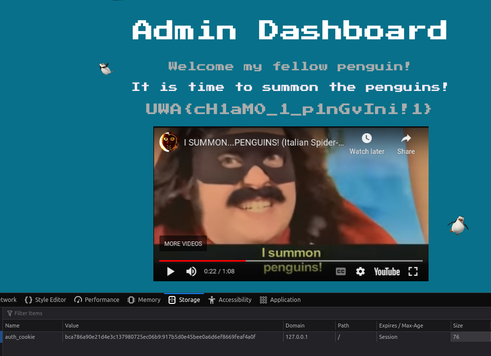

# Challenge

**Name:** Flippin Auth

**Category:** Cryptography

**Difficulty:** Hard

**Flag:** `UWA{cH1aM0_1_p1nGvIni!1}`

**Ports Open:** `3000`

---

## Description

Pingu has developed a web application with *secure authentication* for summoning the penguins around the world to attack the humans. Pingu is very impressed with how they implemented **AES-CBC** for securing **authentication cookies**, and challenges any human to try and break into the `admin` dashboard. The following code was revealed by Pingu showing how the **authentication cookies** are encrypted as proof that it is *secure*.

```python
from Crypto.Cipher import AES
from Crypto.Random import get_random_bytes
from Crypto.Util.Padding import pad, unpad
from binascii import unhexlify

def encrypt_username(key: bytes, username: bytes) -> str:
    """
        Encrypts the username and creates an authentication cookie
    """
    # Generates a random IV for the authentication cookie
    iv = get_random_bytes(AES.block_size)
    cipher = AES.new(key, AES.MODE_CBC, iv)

    enc_username = cipher.encrypt(pad(username, AES.block_size))

    # Returns the authentication cookie in the format {IV}:{encrypted username}
    return f"{iv.hex()}:{enc_username.hex()}"


def decrypt_auth_cookie(key: bytes, auth_cookie: str) -> str:
    """
        Decrypts the authentication cookie and retrieves the user's username
    """
    # Splits the authentication cookie by ':' to get the IV and encrypted username
    iv_hex, enc_username_hex = auth_cookie.split(':')

    # Decodes the IV and encrypted username from hex
    iv = unhexlify(iv_hex)
    enc_username = unhexlify(enc_username_hex)

    # Decrypts the username field
    cipher = AES.new(key, AES.MODE_CBC, iv)
    return unpad(cipher.decrypt(enc_username), AES.block_size).decode()
```

You can try logging into the `guest` account with the password `password1234`, but Pingu laughed at the thought that anyone could **login as `admin`**!

*Can you figure out a way to trick Pingu's website that you are the **`admin`** user?*

**It is highly recommended to read the hints for this challenge!**

---

## Hint 1

On your browser when you are on the challenge website, right click the page and click **Inspect** then go to the **Storage** tab. In the cookies section you can view and modify the `auth_cookie` that the website users for validating the username on the website.

The goal of this challenge is to figure out a way **modify** the `auth_cookie` authentication cookie so when the website decrypts the cookie it will return `admin` instead of `guest`.

---

## Hint 2

AES Cipher Block Chaining (CBC) mode encryption chains encrypted AES blocks by **XORing** the value of the previous block. The important part for this challenge is how AES-CBC mode **decrypts blocks**.


Since both `guest` and `admin` are only 5 characters long, the encrypted text only has 1 block. This means that if we are logged in as the `guest` user ($G$), the encrypted text from AES is $E$ and the initial vector (IV) is $I$ then CBC mode would decrypt to the value of $G$ using the following equation. The XOR operation is denoted as $\oplus$ in the following equations.

$E \oplus I = G$

Your goal is to figure out a $K$ such that:

**$E \oplus I \oplus K = G \oplus K = A$**

You should also read up on the [**mathematical properties of XOR**](https://accu.org/journals/overload/20/109/lewin_1915/)!

---

## Hint 3

You can use [CyberChef](https://gchq.github.io/CyberChef/) to solve this challenge. However, be careful about the padding! You only need to modify **10 characters** in the `auth_cookie`.

---

## Solution

As noted in Hint 2, we want to find a $K$ value such that:

**$E \oplus I \oplus K = G \oplus K = A$**

If we split the equation to just $G \oplus K = A$ then we can rearrange the equation to **$K = A \oplus G$**! We substitute this value for $K$ into the equation:

$E \oplus I \oplus A \oplus G = G \oplus A \oplus G$

One of the mathematical properties of XOR is $G \oplus G = 0$, therefore...

**$E \oplus I \oplus A \oplus G = A$**

Since $I$ (the IV) is included in the `auth_cookie` (first part that is separated by ':'), **you can modify the IV to $I \oplus A \oplus G$ in `auth_cookie` to make the website decrypt the cookie to `admin`!**

You can create the new IV value for the cookie using CyberChef, but the XOR operation in CyberChef **repeats the XOR key** (this will be a common mistake students will make). As noted in Hint 3, you only need to copy the first 10 hex characters because `admin` and `guest` are 5 characters long (the rest would break the AES padding).

For an example, let's say you login as `guest` and the following `auth_cookie` is set.

```
bab68eb31421d4e3c137980725ec06b9:917b5d0e45bee0a6d6ef8669feaf4a0f
```

We copy the IV (`bab68eb31421d4e3c137980725ec06b9`), put it into CyberChef and use the XOR operation twice where the keys are `admin` and `guest`. [Link to the CyberChef recipe.](https://gchq.github.io/CyberChef/#recipe=From_Hex('Auto')XOR(%7B'option':'UTF8','string':'admin'%7D,'Standard',false)XOR(%7B'option':'UTF8','string':'guest'%7D,'Standard',false)To_Hex('None',0)&input=YmFiNjhlYjMxNDIxZDRlM2MxMzc5ODA3MjVlYzA2Yjk)

We copy the first 10 hex characters `bca786a90e` and replace the first 10 characters in the original `auth_cookie`.

```
bca786a90e21d4e3c137980725ec06b9:917b5d0e45bee0a6d6ef8669feaf4a0f
```

Save the new cookie in your browser and refresh the page on `/penguin-dashboard`.



---

## How to run locally

Run the `bash` script in `challenge` named `start_docker.sh`. Otherwise copy the `docker` commands from the script file to build and run the challenge on your local machine. Connect to [http://localhost:3000](http://localhost:3000).