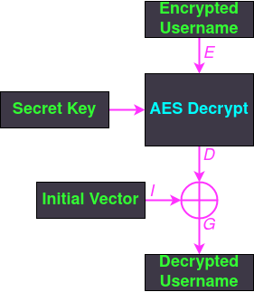

# Challenge

**Name:** Flippin Auth

**Category:** Cryptography

**Difficulty:** Hard

**Flag:** `UWA{cH1aM0_1_p1nGvIni!1}`

**Ports Open:** `3000`

---

## Description

Pingu has developed a web application with *secure authentication* for summoning the penguins around the world to attack the humans. Pingu is very impressed with how they implemented **AES-CBC** for securing **authentication cookies**, and challenges any human to try and break into the `admin` dashboard. The following code was revealed by Pingu showing how the **authentication cookies** are encrypted as proof that it is *secure*.

```python
from Crypto.Cipher import AES
from Crypto.Random import get_random_bytes
from Crypto.Util.Padding import pad, unpad
from binascii import unhexlify

def encrypt_username(key: bytes, username: bytes) -> str:
    """
        Encrypts the username and creates an authentication cookie
    """
    # Generates a random IV for the authentication cookie
    iv = get_random_bytes(AES.block_size)
    cipher = AES.new(key, AES.MODE_CBC, iv)

    enc_username = cipher.encrypt(pad(username, AES.block_size))

    # Returns the authentication cookie in the format {IV}:{encrypted username}
    return f"{iv.hex()}:{enc_username.hex()}"


def decrypt_auth_cookie(key: bytes, auth_cookie: str) -> str:
    """
        Decrypts the authentication cookie and retrieves the user's username
    """
    # Splits the authentication cookie by ':' to get the IV and encrypted username
    iv_hex, enc_username_hex = auth_cookie.split(':')

    # Decodes the IV and encrypted username from hex
    iv = unhexlify(iv_hex)
    enc_username = unhexlify(enc_username_hex)

    # Decrypts the username field
    cipher = AES.new(key, AES.MODE_CBC, iv)
    return unpad(cipher.decrypt(enc_username), AES.block_size).decode()
```

You can try logging into the `guest` account with the password `password1234`, but Pingu laughed at the thought that anyone could **login as `admin`**!

*Can you figure out a way to trick Pingu's website that you are the **`admin`** user?*

**It is highly recommended to read the hints for this challenge!**

---

## Hint 1

On your browser when you are on the challenge website, right click the page and click **Inspect** then go to the **Storage** tab. In the cookies section you can view and modify the `auth_cookie` that the website users for validating the username on the website.

The goal of this challenge is to figure out a way **modify** the `auth_cookie` authentication cookie so when the website decrypts the cookie it will return `admin` instead of `guest`.

---

## Hint 2

AES is a **block cipher encryption algorithm** that encrypts **a fixed size of data**. Let's say we have the following plaintext that is 30 bytes long we will encrypt using AES-128.

```
AES encryption is pretty cool.
```

The **128** in AES-128 signals that the block size is 128 bits (16 bytes) long, so the above plaintext will be broken into following blocks before being encrypted.

*Block 1*
```
AES encryption i
```

*Block 2*
```
s pretty cool.
```

However, just using AES encryption for data that has repeated values is **insecure** because two blocks with the same plaintext will have the same ciphertext. The following *encrypted* image of the Linux penguin is an example of where it is insecure by showing that the *encrypted image* still reveals the outline of the original image.


This is why **cipher block modes of operation** are used around AES to prevent repeated blocks having the same ciphertext.

This challenge uses the **Cipher Block Chaining (CBC) mode of operation** for encrypting the `auth_cookie`. CBC mode works by using the encryption output of the previous block and **XORing** with the plaintext for next block before that block is encrypted using AES. An **initial vector (IV)** needs to be set when using CBC mode to encrypt the first block, since there are no previous blocks when encrypting the first block. The following diagrams show how CBC mode works for encrypting and decrypting data with multiple blocks.

*CBC mode encryption*


*CBC mode decryption*


If you are still confused about cipher block modes and CBC mode, I highly recommend watching [this Computerphile video](https://www.youtube.com/watch?v=Rk0NIQfEXBA).

For this challenge, you need to focus on **CBC decryption** since that is what we want to attack. Below are the following things that we know and have access to:

- The format of the `auth_cookie` is `{initial_vector}:{encrypted_username}` where `{initial_vector}` ($I$) is the initial vector and `{encrypted_username}` is the encrypted username ($G$).
- The web server authenticates users by grabbing the initial vector and encrypted username from the `auth_cookie`, decrypts the username and checks the username.
- You have access to the `guest` account, so when you first login as the `guest` account the `auth_cookie` that is set for your session will decrypt to the value of `guest` ($G$) on the web server.
- You want to **trick the website to decrypt the username to `admin` instead of `guest`**.

The following diagram visualises how the web server authenticates users using CBC mode. You only need to worry about a single block because the usernames for this challenge are less than 16 bytes long.



Of particular interest for this challenge is the **XOR operation that is used after AES decryption**. Let's say that the AES decrypted value is $D$, the initial vector is $I$ and we know that when you login with the `guest` account the decrypted username ($G$) will be `guest`. The following mathematical equation shows this XOR operation where XOR is denoted as $\oplus$.

$D \oplus I = G$

The above equation is all you need to solve this challenge and a basic understanding about the [**mathematical properties of XOR**](https://accu.org/journals/overload/20/109/lewin_1915/).

**You need to figure out a way to a way to manipulate the above XOR equation so the result is the username `admin` instead of `guest`.**

*Focus on things in the above equation that you can manipulate.*

---

## Hint 3

You can use [CyberChef](https://gchq.github.io/CyberChef/) to solve this challenge. However, be careful about the padding! You only need to modify **the first 10 characters** in the `auth_cookie`.

---

## Solution

We want to find a $K$ value such that:

**$D \oplus I \oplus K = G \oplus K = A$**

If we split the equation to just $G \oplus K = A$ then we can rearrange the equation to **$K = A \oplus G$**! We substitute this value for $K$ into the equation:

$D \oplus I \oplus A \oplus G = G \oplus A \oplus G$

One of the mathematical properties of XOR is $G \oplus G = 0$, therefore...

**$D \oplus I \oplus A \oplus G = A$**

Since $I$ (the IV) is included in the `auth_cookie` (first part that is separated by ':'), **you can modify the IV to $I \oplus A \oplus G$ in `auth_cookie` to make the website decrypt the cookie to `admin`!**

You can create the new IV value for the cookie using CyberChef, but the XOR operation in CyberChef **repeats the XOR key** (this will be a common mistake students will make). As noted in Hint 3, you only need to copy the first 10 hex characters because `admin` and `guest` are 5 characters long (the rest would break the AES padding).

For an example, let's say you login as `guest` and the following `auth_cookie` is set.

```
bab68eb31421d4e3c137980725ec06b9:917b5d0e45bee0a6d6ef8669feaf4a0f
```

We copy the IV (`bab68eb31421d4e3c137980725ec06b9`), put it into CyberChef and use the XOR operation twice where the keys are `admin` and `guest`. [Link to the CyberChef recipe.](https://gchq.github.io/CyberChef/#recipe=From_Hex('Auto')XOR(%7B'option':'UTF8','string':'admin'%7D,'Standard',false)XOR(%7B'option':'UTF8','string':'guest'%7D,'Standard',false)To_Hex('None',0)&input=YmFiNjhlYjMxNDIxZDRlM2MxMzc5ODA3MjVlYzA2Yjk)

We copy the first 10 hex characters `bca786a90e` and replace the first 10 characters in the original `auth_cookie`.

```
bca786a90e21d4e3c137980725ec06b9:917b5d0e45bee0a6d6ef8669feaf4a0f
```

Save the new cookie in your browser and refresh the page on `/penguin-dashboard`.


---

## How to run locally

Run the `bash` script in `challenge` named `start_docker.sh`. Otherwise copy the `docker` commands from the script file to build and run the challenge on your local machine. Connect to [http://localhost:3000](http://localhost:3000).