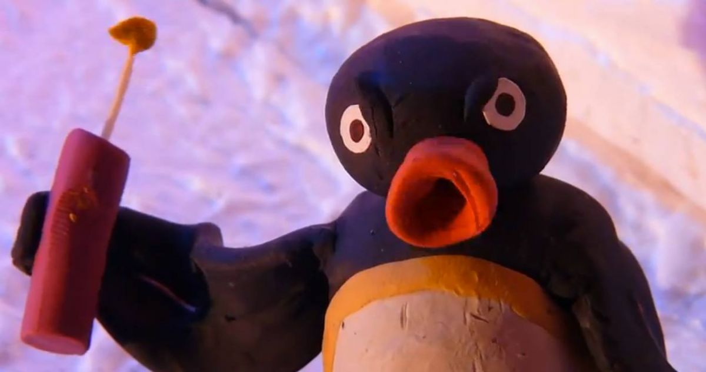
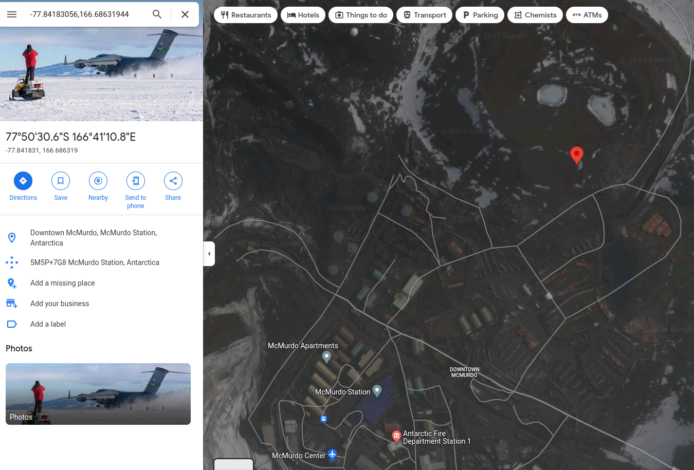

# Challenge

**Name:** Noot Noot

**Category:** Forensics

**Difficulty:** Easy

**Flag:** `UWA{McMurdo Station}`,`UWA{McMurdoStation}`,`McMurdo Station`,`McMurdoStation`,`UWA{McMurdo}`,`McMurdo`

---

## Description

Pingu got really mad with Alex for making all of these hard challenges for the CITS1003 CTF assignment and sent the following email with the attached image below.

```
Dear Alex,

Give me the flags for the CITS1003 assignment or I am going to 'noot noot' your house.

Kind regards,
Not Pingu
```



*Using the image, can you figure out the nearest station where Pingu took the photo?*

---
## Hint

Images contain *metadata* that might be useful to figure out where the photo was taken.

---

## Solution

Looking at the exif data of the image, we can see that the photo was taken with the following GPS coordinates. There are a lot of online tools to do this. I used the `exiftool` for getting the metadata.

```
GPS Latitude                    : 77 deg 50' 30.59" S
GPS Longitude                   : 166 deg 41' 10.75" E
GPS Position                    : 77 deg 50' 30.59" S, 166 deg 41' 10.75" E
```

Converting the latitude and longitude from degrees to decimal format using [this tool](https://www.latlong.net/degrees-minutes-seconds-to-decimal-degrees), we get the latitude and longitude of `-77.84183056,166.68631944` respectively. Do note that the tool returns a positive value for the latitude, but the GPS direction is south so it needs to be negated. Using Google maps, the nearest station is McMurdo Station.

